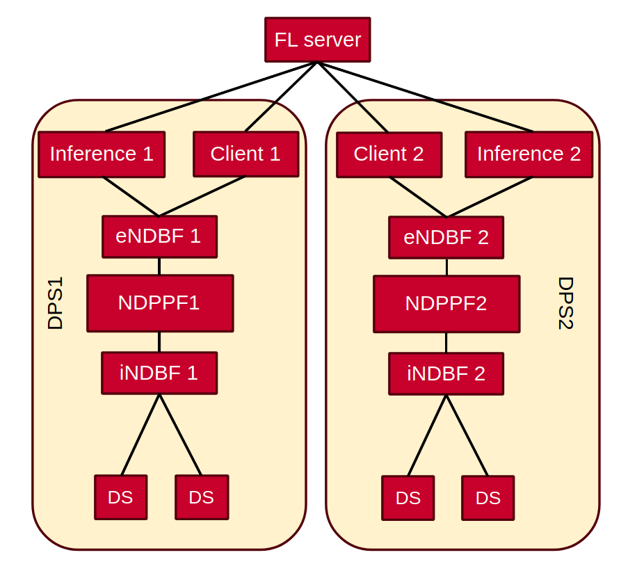
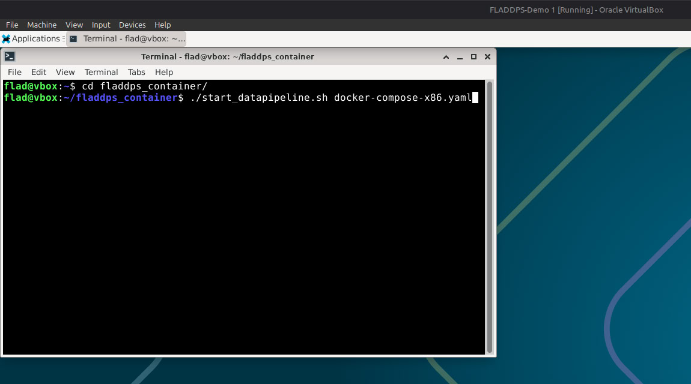
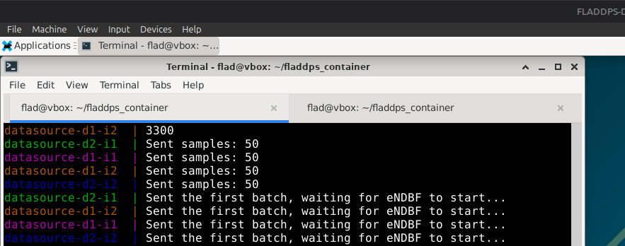

# FLADDPS (Federated Learning Anomaly Detection Data Pipline System) Demo

This demo showcases a **real-time online federated learning system** with **anomaly detection** built on top of a data pipeline architecture.  
You can run this demo on your own computer and experiment with it!

---

## Overview

The system simulates a small-scale federated learning setup with multiple data sources, preprocessing, training, and inference components — all running as **containers**.

Each block in the topology (see image below) represents a container.




### System Components

#### Data Sources
There are **4 data sources**, each representing a **dummy 5G gNodeB** node.  
These containers are our source to generate **CPU metrics** that are:
- Collected and published to the **specific topic** (cpu_metrics_dps_1).
- Publish to their corresponding **iNDBF** containers.

#### Data Broker
The **data broker** aggregates metrics from all data sources that match the subscribed topic and forwards them to the **preprocessing unit** (`NDPPF`).

#### Preprocessing & Distribution
The **NDPPF** processes and distributes metrics to **client containers** (`FLClient`), where local model training takes place.


### Federated Training Workflow

There are two Data Pipleline System (DPS) in each one of them:

1. **Clients** receive data streams from the preprocessing unit.  
2. Each client **trains locally** on its own data.
3. After each epoch, the clients send their **model updates** to the **Federated Learning Server (FLServer)**.
4. The **FLServer** aggregates the received models.
5. The **aggregated model** is then sent back to all clients and inference units.
6. This process continues iteratively until training finishes by reaching the required rounds.


### Anomaly Generation

Once training is complete:
- The data sources begin to **generate anomalies** by **randomly altering their CPU and RAM usage**.
- A copy of the data is continuously sent to the **inference component** even during training.

This allows you to **monitor model learning progress** in real time.

---

## How to run this demo:
### A. Using the provided VMs (Ready to run):
1. Download a hypervisor:

    A. If you have x86 machines (Intel/AMD CPU) install VirtualBox [Download VirtualBox](https://www.virtualbox.org/wiki/Downloads).

    B. If you have MacBooks with Apple silicon (M1-M4), install UTM [Download UTM](https://mac.getutm.app/)

    Make sure you run and test the hypervisors for the first time.

2. Download and run the provided ready to run VM:

    A. [VirtualBox VM](https://box.roc.cnam.fr/index.php/s/6rjHxcLgyNCTGyc) for x86 devices. 
        
    Download the `FLADDPS-Demo.ova` file.

    Open VirtualBox and import it: File -> Import Appliance... (Ctrl + I), it will take some time. The VM needs at least 6GB (assign 8GB if its possible) of ram to run. You can change these settings in VirtualBox settings.

    Start the VM (Username and Password: flad/flad).

    B. The two files: [UTM VM main](https://box.roc.cnam.fr/index.php/s/eDLGZX4A9f9nrfe) `Flad_Demo_archive.zip` and [UTM VM part1](https://box.roc.cnam.fr/index.php/s/LcsExKfTaprqrgn) `Flad_Demo_archive.z01` are for arm MacBooks.
    Download the two Zip files and put them in the same folder.
    - You can use [The Unarchiver](https://theunarchiver.com/)  and extract the `.zip` file using GUI (It will combine them automatically).
    - Or use terminal:
    ```
    zip -s 0 Flad_Demo_archive.zip --out Flad_Demo.zip
    unzip Flad_Demo.zip
    ```
    Now you should see a `.utm` file, double click on it, UTM should open it, The VM needs at least 6GB (assign 8GB if its possible) of ram to run. You can change these settings on UTM settings.

    Start the VM (Username and Password: debian/debian).

3. Run the demo:

    A. Open the terminal:
    ```
    cd fladdps_container

    # [Recommended] Get the latest version:
    git pull

    # For x86 devices: 
    ./start_datapipline.sh docker-compose-x86.yaml
    # For arm devices: 
    ./start_datapipline.sh docker-compose-arm.yaml
    ```
    
    B. Wait until the first batch of data sent, open another teminal (tab/window) and run:
    
    ```
    python3 live_plots.py
    ```
    
    to see the real-time plot.
---
### B. Using docker:
#### Run the demo:
##### This will work on Mac and Linux, if you have windows you can run the commands inside `start_datapipline.sh` manually.
1. Clone the project:
    ```
    git clone https://gitlab.roc.cnam.fr/goyban/fladdps_container.git
    ```
    Make sure docker and docker compose are installed.

    Run:
    ```
    docker run hello-world # For docker
    docker compose version # For docker compose
    ```
2. Run the demo:
   ```
    cd fladdps_container

    # For x86 devices: 
    ./start_datapipline.sh docker-compose-x86.yaml
    # For arm devices: 
    ./start_datapipline.sh docker-compose-arm.yaml
    ```
    **Note**: You can stop it any time by pressing `ctrl + C` or force stop it by pressing `ctrl + C` twice.

    **Note: The model will be trained on your machine's CPU metrics on real-time!** So make sure you don't use it during the training.

    **Note:** It will take some time to pull the containers for the first time.
3. Check the output in "Output" folder
4. If you want to follow the logs for a spedific container:
    ```
    docker compose -f docker-compose-<x86/arm>.yaml logs -f {container name}
    ```
    Checking the logs for only flclient-1:
    ```
    docker compose -f docker-compose-<x86/arm>.yaml logs -f flclient-1
    ```
    Checking the logs for multiple contianers:
    ```
    docker compose -f docker-compose-<x86/arm>.yaml logs -f flclient-1 flclient-2 flserver ... # or add more
    ```
5. Check the live plot, run `live_plots.py`:
    ```
    python3 live_plots.py
    ```
    **In order for `live_plots.py` to work properly you need to install `pandas`, `matplotlib` and `dotenv`.**

    **If you already have python venv on our machine, you should be able to `source rtplot/bin/activate`.**

---
#### Explore the code
##### The structure of the project:
    ├── DATASOURCE                  # Files and configs related to datasource containers
    │   ├── config                  # Configs and start scripts
    ├── docker-compose-x86.yaml     # Docker compose file for x86
    ├── docker-compose-arm.yaml     # Docker compose file for arm
    ├── FLInstant                   # Files and configs related to Server, Client and Inference containers
    │   ├── config                  # Configs and start scripts
    │   └── in_network_federaed_learning_for_anomaly_detection  # The source code
    ├── live_plots.py               # To plot the inference results
    ├── NDBF                        # Files and configs related to data broker containrs
    │   └── config                  # Configs and start scripts
    ├── NDPPF                       # Files and configs related to post processing containr
    │   ├── config                  # Configs and start scripts
    │   └── network_data_preprocessing_function                 # The source code
    ├── README.md
    ├── .env                        # Main .env file, contains variables, IP addresses and global configs like Number of rounds, epochs, ...
    └── start_datapipeline.sh       # Main script to run the Datapipeline
    


### In order to know how to modify the data pipeline, you can change some part of the code and see its effect.

#### 1. Make the easy changes

- The demo runs for 20 rounds, 3 epochs, you can change that.
- You can edit the `.env` file, set `FED_CONFIG_R` and `FED_CONFIG_E` in order to train it for more or less rounds/epochs or other configurations related to network, topology and runtime.

#### 2. Change the code:
- Each container has a config directory. You can check that folder and the .sh script to see how each container starts.
- The source code is also available and possible to change.

#### 3. Run a better version:
This demo is designed to train and finish fast, you can run a better and longer version:
- Open `FLInstant/config/run_client.sh`,  and comment this line:
    ```
    cp /app/confs/client_multi_current.py /in_network_federaed_learning_for_anomaly_detection/FLClients/
    ```
- Open `.env` and increase the `FED_CONFIG_R` to at least 30 rounds.
- Now run the demo again, it will take more time to train but would be more accurate.
- You can compare the difference by comparing the plot.
- To compare the codes you can run:
    ```
    diff FLInstant/config/client_multi_current.py FLInstant/in_network_federaed_learning_for_anomaly_detection/FLClients/client_multi_current.py
    ```
### Now you should know how the Datapipeline works and how to change some parts of the code.
